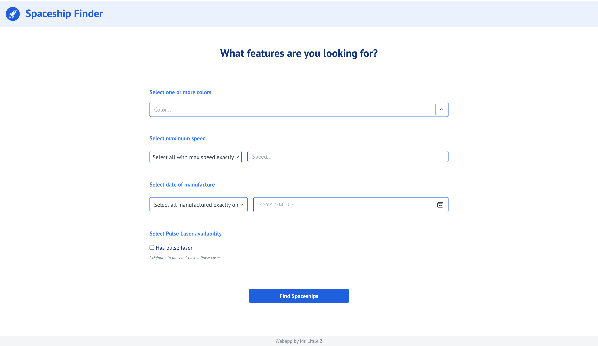
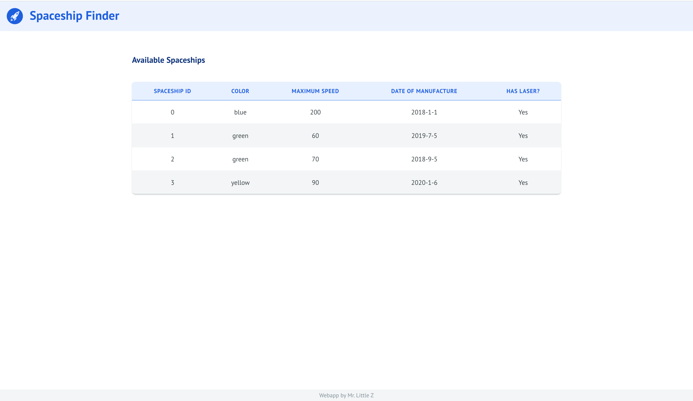

# Spaceship Finder App
This app was built with React and [Tailwind CSS](https://tailwindcss.com/) and bootstrapped with [Create React App](https://github.com/facebook/create-react-app).

## To Run the App
To run this app locally in development mode, cd into the project directory and run:

### `npm install`
Installs all dependecies

### `npm start`
Runs the app in development mode.\
Open [http://localhost:3000](http://localhost:3000) to view it in your browser.

### Or visit the live deployed app on [Netlify](https://spaceship-finder.netlify.app/)

## About the App
The app is composed of two pages:\
- The Filter page displaying all of the individual filter components

- The Result page displaying the data retrieved based on the filter parameters
\

The filter parameters are stored in a state variable like so, and updated any time the user selects changes their filter selections:
```
    const [filters, setFilters] = useState({
        'colors': [],
        'date': ['2018-1-1', false, false], //contains three elements [date (string), inclue all Before flag (boolean), include all After flag (boolean)]. Defaults to manufactured exactly on 1/1/2018
        'speed': [50, false, false], //contains three elements [speed (int), include all Greater flag (boolean), include all Less flag (boolean)]. Defaults to speed exactly equal to 50
        "laser": "no-laser" //Defaults to no laser
    }) 
```

Clicking on "Find Spaceships" will generate the query string which is dynamically passed via the URL when navigating to the Results page.\
The URL will look something like that: http://localhost:3000/filter?colors=green&date=2018-1-1%2B&speed=50%2B&laser=with-laser .\
The query string is then parsed on page load and data is retrieved and displayed accordingly.


